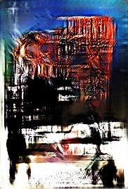

# PosterGAN Log

10/27/2023

I will implement a conditional GAN (CGAN) to generate novel, authentic-looking posters given the ~~title~~ genre [10/28] of a movie. To do this, we will train on a dataset of movie poster images while using the ~~title~~ genre(s) [10/28] of the movie as the corresponding label.

Our generator $G_\theta$ will be be conditioned on the movie ~~title~~ genre(s) [10/28] $y$ and pushforward samples from an underlying latent distribution $z \sim p_z(\cdot)$ (maybe a multidimensional Gaussian?). The output image will be output by $G_\theta (z \mid y)$. Similarly, the discriminator (or critic) $D_\psi$, conditioned on $y$, will score the output of $G_\theta$ as well as samples from the data distribution $x \sim p_x(\cdot)$: $D_\psi(x \mid y)$.

We'll go ahead and use the Wasserstein GAN objective functions:

* Discriminator (Critic)
$$
    \max_{\psi \in \Psi} \mathbb{E}_{x \sim p_x} [D_\psi(x \mid y)] - \mathbb{E}_{z \sim p_z} [D_\psi(G_\theta(z\mid y) \mid y)]
$$

* Generator
$$
    \min_{\theta \in \theta} \mathbb{E}_{z \sim p_z} [D_\psi(G_\theta(z \mid y) \mid y)]
$$
I hope my conditionals are correct here...

Hopefully this goes well!

Challenges:

1. Finding a good dataset (here is one from a movie genre classification problem that could be good. Images are 268x182: https://github.com/benckx/dnn-movie-posters/tree/master/data)
2. Rescaling the images
3. Implementing the GAN generator and descriminator

Let's gooooooooo.

---
10/28/2023

### Titles -> Genres

New plan. Dealing with the char/word embeddings for the titles seems annoying to deal with (at least for now). This is because word embeddings for variable length strings are rather complicated when attempting to capture intricate semantic dependencies.

Instead of movie titles, I will condition on a specific *genre* so that the ouptut of the generator is a poster corresponding to a movie of that genre. This makes the implementation easier since we have finite number of genres in the dataset (28 in MovieGenre.csv), so we can encode them as one-hot vectors in $\mathbb{R}^{28}$. If this works well, maybe I will transition back to conditioning on movie titles.

---
10/30/2023

### *Improved Training of WGANs* - Gulrajani, et al.

After Dan Ralston's excellent presentation of some fundamental papers in the GANs literature, I was turned onto the paper *Improved Training of WGANs* which does away with the clipping of the descriminator weights described in the original WGAN paper.

The former paper demonstrates that the Lipschitz condition for the discriminator can be inforced through an $L^2$ penalty on the gradient of the discriminator with respect to an input which is interpolated between a fake data sample and real data sample. Pretty awesome. In particular, clipping may be too strong of a constrain on the discriminator and will inadvertently restrict the class of function we are capable of learning.

In math, this new loss term is
$$
    \lambda ( || \nabla_{\hat{x}} D_\psi (\hat{x})||_2 - 1)^2
$$
The interesting part is that $\hat{x} = \epsilon x + (1-\epsilon) \tilde{x}$ where $\epsilon \sim U[0,1]$, $x$ is a real sample from the dataset, and $\tilde{x}$ is a fake sample from the generator.

*Note*: I still have yet to successsfully run the program without errors. Initially there was a dimension mismatch where the discriminator expected a 3x268x182 RGB image, but several of the posters are B&W and, therefore, have dimensions 1x268x182. This was easily remidied by duplicating the pixel values 3 times to match the expected input dims. This works because color is additive (apparently).

After this fix, I stumbled onto a new dimension mismatch problem which I am still figuring out.

---
11/07/2023

Success!! Kinda

I solved the dimension mismatch problem. The issue is that if `batch_size` doesn't divide `len(training_data)`, then the final batch of the epoch will be of length `len(training_data) % batch_size`. This cause a confilt since the latent samples `z` were taken to be of shape `(batch_size, 100)`, but the first dimension needs to match the size of every batch. I easily remedied this by sampling `z` at the appropriate shape.

I managed to run two small-scale tranings without errors. Does this actually mean my GAN works? Who knows. Here are the stats for the two independent training sessions:

Training 1:
* Batch size: 32
* Epochs: 2
* Percentage of dataset used for training: 25%
* Training time: ~1:00:00

("Action" poster generated after Training 1)

Training 2:
* Batch size: 64
* Epochs: 5
* Percentage of dataset used for training: 80%
* Training time: ~8:45:00

("Action" poster generated after Training 2)

The posters aren't there yet, and it's unclear if simply more training is need or if there are subtler issues to fix. All I know is that GANs are finicky things to train.

*Next Steps*:

Move PyTorch tensors to my Macbook's GPU to see if we get faster performance. 

Also, I need to learn how the generator and discriminator losses should behave with time under ideal training. Typically, I expect that a decreasing training loss is a good indicator of learning. However, since the generator's goal is to fool the discriminator, I'm not sure what kind of behavior to expect from both losses over time. During my two trainings I've seen the losses reach values on the order of $10^2$, and I have no clue if that's expect or not. I shall look into this and report back.

Finally, I realized that the *Improved Training of WGANs* paper removes the batch norm layers from the discriminator since the batch normalization affects $\nabla_{\tilde{x}} D_\psi(\tilde{x})$ in an undesirable way by correlating samples within each batch.

---
11/03/2023

Tis late, but the tidings are jolly! 

Using the MPS backend (which allows me to take advantage of my Macbook's GPU acceleration) has been a total game changer. Before moving all my tensors to the GPU, each epoch of training took about 1.5 hours of training. After utilizing the GPU, the time decreased to less than 10 minutes per epoch. Amazing!

The resulting posters are getting better as well! Here are outputs from the third training.

Training 3:
* Batch size: 64
* Epochs: 20
* Percentage of dataset used for training: 90%
* Training time: ~3:00:00

("Horror" poster generated after Training 3)

("Family" poster generated after Training 3)

("Action" poster generated after Training 3)

*Technical note*:

I removed the batch norm layers from the discriminator since this theoretically alters the gradient penalty for it's loss.

Regarding the GPU acceleration, I can probably get even faster resutls by moving all the training data to the GPU at the start of the training iterations instead of during each training loop. I assume there is some overhead required to move the tensors every iteration.

I still have yet to look into what the generator and discriminator losses should be converging to.

---
11/07/2023

Training 4:
* Batch size: 64
* Epochs: 60
* Percentage of dataset used for training: 100%
* Training time: not recorded

"Action" poster

"Drama" poster

"Horror Sci-Fi" poster

The posters may have slightly improved going from 40 to 60 training epochs, but not significantly. The seems to be approaching a plateau which means I will have to look for other ways to improve. This could mean anything from playing with the GAN architecture to messing with learning rates.

Significantly—and disappointingly, I might add—I cannot distinguish between the outputs corresponding to different genres. Perhaps I need to rethink my genre encodings. Maybe instead of one-hot (in this case, many-hot) encodings, I should instead use a probability vector. Although I don't have information about the probability that each poster falls within a genre, I can instead treat all the genres in a poster's label as having equal probability.

I'll still try to train for more epochs to see if the results improve further.